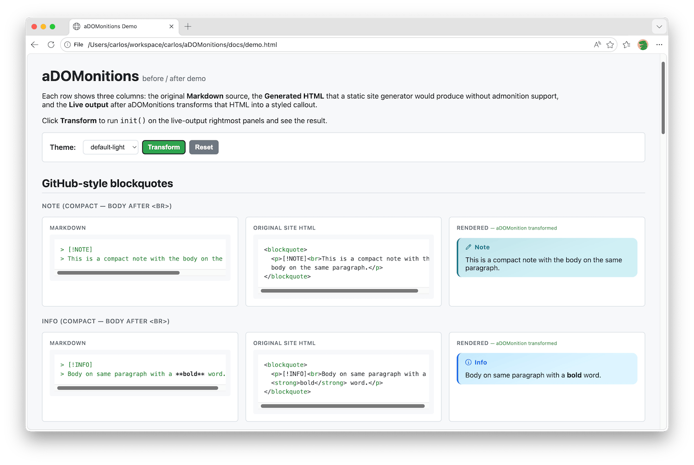
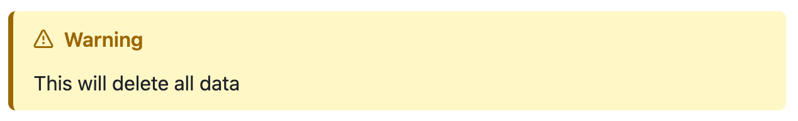

# aDOMonitions

Styled admonition callouts generated on page load, for static site generators
whose Markdown renderer doesn't support them.

Checkout the [Quickstart](https://carlosperate.github.io/aDOMonitions/quickstart.html) to get up and running right away!

Look at the [Demo page](https://carlosperate.github.io/aDOMonitions/demo.html) to view all the callouts and themes:



## What is this?

This JavaScript library scans the DOM for Admonition markers in HTML generated
by a static site generator without built-in admonition support.

Admonitions are highlighted callout boxes, like "Note", "Warning", "Tip", etc;
used to draw attention to important content.
Normally Markdown renderers only support these via build-time plugins,
so without these plugins, the markers end up as plain text in the HTML.

aDOMonitions can look for either GitHub-style or Docusaurus-style markers.
When it finds them, it transforms the corresponding HTML into styled,
accessible callout boxes with icons, colours, and ARIA roles.

For example, a GitHub style Markdown Admonition:

```markdown
> [!WARNING]
> This will delete all data.
```

Is likely converted to this raw HTML by static site generators without
built-in admonition support:

```html
<blockquote>
  <p>[!WARNING]</p>
  <p>This will delete all data.</p>
</blockquote>
```

Running aDOMonitions transforms that HTML into this styled callout box,
with accompanying CSS for colours, layout, and an icon:

```html
<div class="adomonitions adomonitions-warning" role="alert" aria-label="Warning">
  <p class="adomonitions-title">
    <span class="adomonitions-icon" aria-hidden="true"><!-- SVG --></span> Warning
  </p>
  <p>This will delete all data.</p>
</div>
```



## Install and run

```bash
npm install adomonitions
```
```js
import { init } from "adomonitions";
init(); 
```

Or load via a `<script>` tag (UMD):

```html
<script src="https://unpkg.com/adomonitions/dist/adomonitions.umd.min.js"></script>
<script>
  adomonitions.init();
</script>
```

Check out the [Quick Start guide](docs/quickstart.md) for more examples.


## Themes

Eight bundled themes, injected automatically as a `<style>` tag:

| Theme           | Description |
|-----------------|-------------|
| `default-light` <br> `default-dark` <br> `default-auto` | Tinted background with rounded corners, **default** |
| `github-light`  <br> `github-dark`  <br> `github-auto`  | GitHub callout style (transparent bg, left border highlight), light |
| `material`      | MkDocs Material style (shadow, uppercase title) |
| `docusaurus`    | Docusaurus/Infima style (thick border, heavier title) |

Set `theme: null` to skip CSS injection and bring your own styles. Standalone CSS files are also available at `dist/themes/` for use via `<link>` tags.

## Documentation

- [Quick start](docs/quickstart.md) — install, first call, full HTML example
- [Configuration reference](docs/configuration.md) — all options with defaults and examples
- [Customisation guide](docs/customization.md) — CSS overrides, custom icons, BYO themes, dark mode

## License

[MIT](LICENSE)
